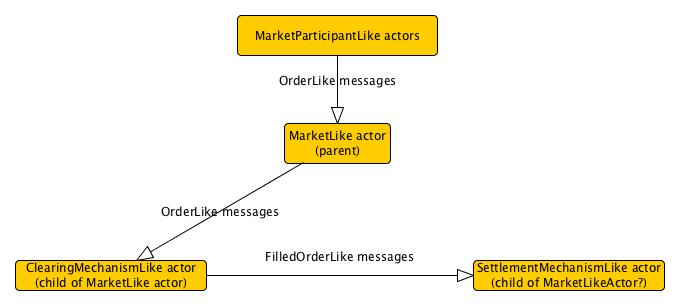
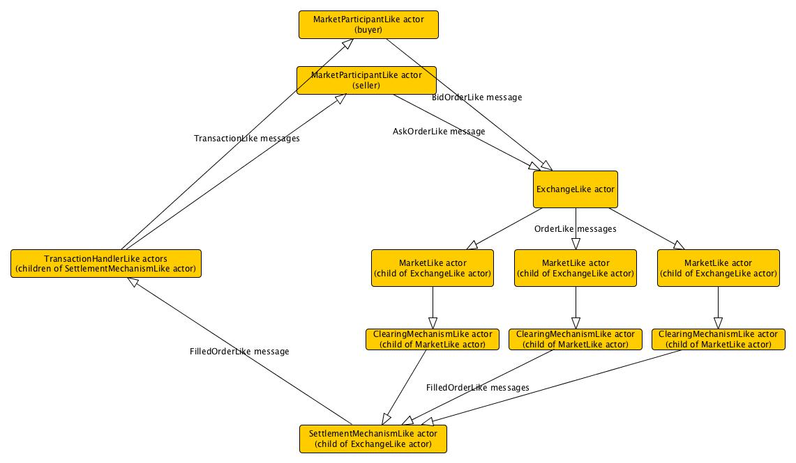

# markets-sandbox

A sandbox for building and testing scalable implementations of various market micro-structures. The `markets-sandbox` extends the functionality of the `contracts-sandbox`.

## Some ideas for an API for scalable markets...
In some abstract sense a `MarketLike` institution can be thought of as a function that takes as an input some `ContractLike` object (i.e., ask and bid orders) and returns a sequence of other `ContractLike` objects (i.e., filled or matched orders). There are many different types of `MarketLike` institutions: continuous double auctions, call auctions, posted offer, bilateral negotiation, etc.  Each of these various market institutions corresponds to a different functional form that operates on `ContractLike` objects.

The Markets API explicitly defines various dis-equilibrium adjustment processes by which markets are cleared (i.e.,  prices and quantities are determined). It is important to be clear about the definition of the term "market clearing." Oxford Dictionary of Economics defines "market clearing" as follows:

1. The process of moving to a position where the quantity supplied is equal to the quantity demanded.
2. The assumption that economic forces always ensure the equality of supply and demand.

In most all macroeconomic models (i.e., RBC, DSGE, etc) it is assumed that economic forces outside the model insure that supply matches demand in all markets. This market clearing assumption is really two implicit assumptions:

1. The dynamic adjustment processes by which real markets are cleared operates at time-scales that are much smaller than the relevant time-scale of the model. Perhaps markets clear daily, but we our relevant time-scale is quarterly.
2. There are no feedback effects between the dynamic adjustment processes by which real markets are cleared and the longer run dynamics of the economy.

The algorithms in the `markets-sandbox` represent various ways of modeling the dynamic adjustment process by which real world markets markets are cleared.

### Requirements
The Markets API needs to be sufficiently flexible in order to handle markets for relatively homogeneous goods (firm non-labor inputs, firm outputs, final consumption goods, standard financial products etc.) as well as markets for relatively heterogeneous goods (i.e., labor, housing, non-standard financial products, etc).

Here is my (likely incomplete) list of requirements...

* Receive buy (or bid) and sell (or ask) orders from other actors.
* Accept (reject) only valid (invalid) buy and sell orders.
* Handle queuing of accepted buy and sell orders as necessary.
* Order execution including price formation and, if necessary, quantity determination.
* Processing and settlement of executed orders once those orders have been filled.
* Record keeping of orders received, orders executed, transactions processed, etc.

**Problem:** too many requirements for a single market actor to satisfy. **Solution:** model the market actor as a collection of actors. Specifically, suppose that each `MarketActor` is composed of two additional actors: a `ClearingMechanismActor` that receives buy and sell orders and generates filled orders, and then a `SettlementMechanismActor` that processes the resulting filled orders and creates actual transactions.

### `MarketActor`
The `MarketActor` should directly receive buy and sell orders for a particular `Tradable`, filter out any invalid orders, and then forward along all valid orders to a `ClearingMechanismActor` for further processing.

### `ClearingMechanismActor`
A `ClearingMechanismActor` should receive orders and fill them using its matching engine. Filled orders are then sent to a `SettlementMechanismActor` for further processing. Note that each MarketLike actor should have a unique clearing mechanism.

#### Order execution
In our API, however, a key component of a `ClearingMechanismActor` is a `MatchingEngineLike` module. A `MatchingEngineLike` module handles any necessary queuing of buy and sell orders, order execution (including price formation and quantity determination), and generates filled orders. Note that a `MatchingEngineLike` module is similar to an auction mechanism in many respects. [Friedman (2007)](http://www.sciencedirect.com/science/article/pii/S0167268106002757) lists four major types of two-sided auction mechanisms commonly implemented in real world markets.

* Posted offer (PO): PO allows one side (say sellers) to commit to particular prices that are publicly posted and then allows the other side to choose quantities. PO is the dominant clearing mechanism used in the modern retail sector.

* Bilateral negotiation (BLN): BLN requires each buyer to search for a seller (and vice versa); the pair then tries to negotiate a price and (if unsuccessful) resumes search. BLN clearing mechanisms were prevalent in preindustrial retail trade, and continue to be widely used in modern business-to-business (B2B) contracting. Some retail Internet sites also use BLN clearing mechanisms.

* Continuous double auction (CDA): CDA allows traders to make offers to buy and to sell and allows traders to accept offers at any time during a trading period. Variants of CDA markets prevail in modern financial markets.exchanges such as the New York Stock Exchange (NYSE), NASDAQ, and the Chicago Board of Trade and are featured options on many B2B Internet sites.

* Call auction (CA): The CA requires markets.participants to make simultaneous offers to buy or sell, and the offers are cleared once each trading period at a uniform price.

Each of these auction mechanisms would correspond to a particular implementation of an `MatchingEngineLike` behavior.

TODO: similarly classify the various types of single-sided auction mechanisms commonly implemented
in real world markets.

#### Order queuing
Order queuing involves storing and possibly ordering received buy and sell orders according to some defined `Ordering`. Different orderings will be distinguished from one another by...

1. type of collection used for storing buy and sell orders,
2. the `Ordering` applied to the collections of buy and sell orders.

For example, some `OrderQueuingStrategy` behaviors might only require that unfilled buy and sell orders are stored in some collection (the sorting of buy and sell orders within their respective collections being irrelevant). Other `OrderQueuingStrategy` behaviors might have complicated `OrderBookLike` rules for sorting the stored buy and sell orders.

### Use cases for `MarketActor`
In this section I sketch out some specific use cases for the Markets API.

#### Retail goods market
Retail goods markets are markets for final consumption goods (typically purchased by households). `RetailMarketActor` behavior would extend generic `MarketActor` behavior with:

* Some `ClearingMechanismActor` using a `PostedOfferLike` matching engine,
* A `BilateralSettlement` settlement mechanism.

#### Wholesale goods market
Wholesale goods markets are markets for intermediate goods (typically purchased by firms and then used in the production of retail goods). `WholesaleMarketActor` behavior would extend `MarketActor` behavior with:

* Some `ClearingMechanismActor` using a `BilateralNegotiationLike` matching engine,
* A `BilateralSettlement` settlement mechanism.

#### Labor market
Labor can be a very heterogenous commodity (which makes labor markets tricky). `LaborMarketActor` behavior would extend MarketLike behavior with:

* Some `ClearingMechanismActor` using either a `BilateralNegotiationLike` or `PostedOfferLike` matching engine,
* A `BilateralSettlement` settlement mechanism.

#### Housing market
Note similarity of `HousingMarketActor` to `RetailMarketActor`. `HousingMarketActor` behavior would extend `MarketActor` behavior with:

* Some `ClearingMechanismActor` using a `PostedOfferLike` matching engine,
* A `BilateralSettlement` settlement mechanism.

#### Securities market
`SecuritymarketLike` markets would include markets for stocks, bonds, currencies, etc. Could even create a `SecuritiesExchangeLike` actor which would route orders for various securities to the appropriate `SecuritiesMarketActor` actor. `SecuritiesMarketActor` behavior would extend `MarketActor` behavior with:

* Clearing mechanism with `ContinuousDoubleAuctionLike` matching engine and `OrderBookLike` order queuing strategy,
* `CentralCounterpartySettlement` settlement mechanism.

#### Unsecured interbank lending market
See Perry Mehrling for more details on unsecured interbank lending markets. `InterbankMarketActor` behavior would extend MarketLike behavior with:

* Some `ClearingMechanismActor` using either a `BilateralNegotiationLike`,
* A `BilateralSettlement` settlement mechanism.

#### Secured interbank lending (repo) market
See Perry Mehrling for more details on secured interbank lending (repo) markets. `RepoMarketActor` behavior would extend MarketLike behavior with:

* Some `ClearingMechanismActor` using either a `BilateralNegotiationLike`,
* A `BilateralSettlement` settlement mechanism.

### `ExchangeActor`
An `ExchangeActor` is a collections of `MarketActor`s that share a common settlement mechanism. I suspect that this might be a typical use case.

Quick list of requirements for an exchange...

* `ExchangeActor` should be able to add and remove `MarketActor`s.
* `ExchangeActor` should be able to route buy and sell orders to the appropriate `MarketActor`.
* `ExchangeActor` should reject invalid orders.
* `ExchangeActor` should have access to some settlement mechanism.

